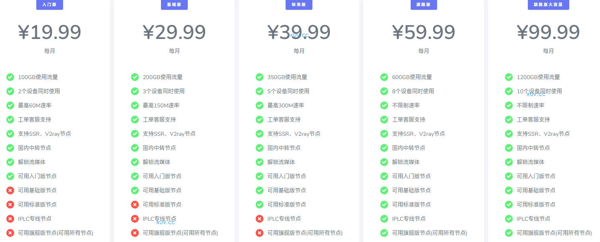

# 桔子云官网地址2025最新入口 + 最新优惠码

永久官网：[juzicloud.net](https://xuv.cc/out/juzi)

地址1：[https://juzi82.xyz](https://juzi82.xyz/auth/register?code=sIUI)

地址2：[https://juzi77.xyz](https://juzi77.xyz/auth/register?code=sIUI)

## 简介

桔子云(juziyun)，juzicloud，某大机场分站。新站价格便宜，线路带宽充裕不拥挤。最高每月500GB使用流量，8个设备同时使用，不限制速率。

支持SSR、V2ray节点，国内中转节点，解锁流媒体，CN2/BGP隧道中转和IPLC国际专线节点。

支持支付宝、微信支付。

## 桔子云优惠码

【juziyun优惠活动】

桔子云2025包年7折优惠代码：[JJ369](https://xuv.cc/out/juzi)

## 桔子云特色

<ul>
	<li>流量充足，价格便宜，线路节点档次分明，覆盖绝大多数人群的使用需求；</li>
	<li>支持主流客户端 SSR/V2Ray 订阅链接；</li>
	<li>拥有遍布全球的CN2 GIA/BGP/IPLC内网专线等优质线路节点；</li>
	<li>国内采用CN2/BGP入口，隧道中转，极速稳定；</li>
	<li>付费节点全部解锁Nitflix/HULU/HBO等国外流媒体；</li>
</ul>

## 桔子云套餐价格列表

|套餐|入门版|基础版|标准版|旗舰版|旗舰版大流量|
|----|----|----|----|----|----|
|月付|￥19.9|￥29.9|￥39.9|￥59.9|￥99.9|
|季付|￥59.9|￥89.9|￥119.9|￥179.9|￥299.9|
|半年付|￥119.9|￥179.9|￥239.9|￥359.9|￥599.9|
|年付|￥239.8|￥359.8|￥479.8|￥719.8|￥1199.8|
|两年付|￥479.7|￥719.7|￥959.7|￥1439.7|￥2399.7|

## 桔子云官网常见问题

问：我按照教程配置完毕后但是还是无法访问外网。

1. 请先同步你的系统时间。
2. 检查你的游览器是否有代理插件，如果有的话请卸载。
3. 然后将软件调成直连模式。
4. 重启你的设备，在进行尝试。

问：我无法更新订阅，请问应该怎么办？

1. 请把你的订阅地址复制到游览器看能否打开或下载到TXT文件。
2. 如果能打开或下载到TXT文件，那就是系统的问题，请先同步你的系统时间然后将你的软件调整到直连模式并重启你的设备。
3. 如果不能打开或下载到TXT文件，那就是网络的问题，先去网站节点列表手动添加一个节点，确定这个节点能用并且连接这个节点开启全局代理模式在进行更新订阅。

问：节点名称开头的V1、V2、V3、V4分别代表什么？

答：V1代表旗舰版节点，V2代表标准版节点，V3代表基础版节点，V4代表入门版节点。

问：我购买VIP后是否有限速？

答：V1不限制速率，V2最高速率300M，V3最高速率150M，V4最高速率60M。

问：我购买、升级、续费套餐需要注意些什么？

1. 购买相同等级套餐：流量不会叠加，时间会叠加。
2. 购买不同等级套餐，流量和时间都不会叠加。
3. 如需更换套餐，请至首页点击【升级套餐】按钮。
4. VIP会员到期流量是会清零的，年费、半年、季费会员流量为一次性到账，相对来说年费划算些，流量有一年有效期。

## 桔子云跑路了吗？

暂时没有。不过机场总会有跑路风险，为尽可能减少损失，选购套餐可按月支付。
